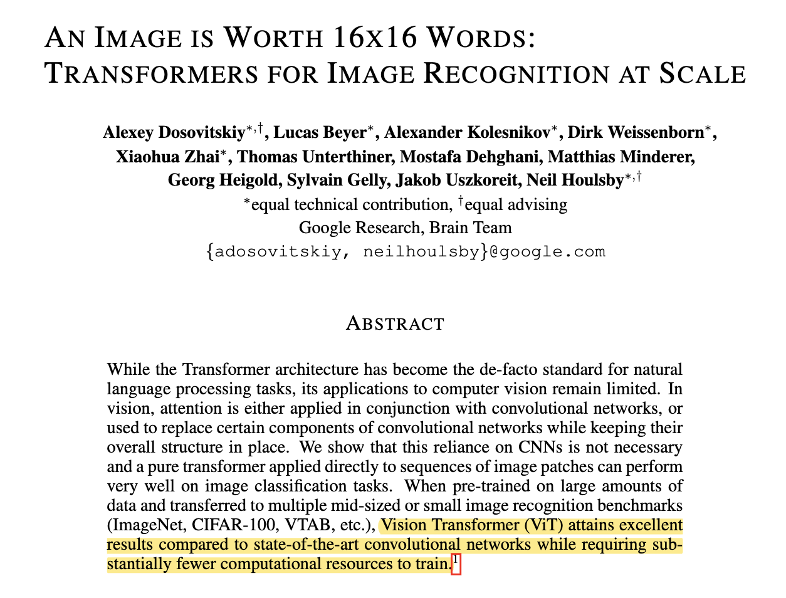
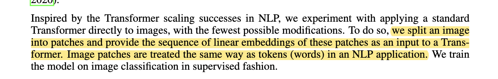
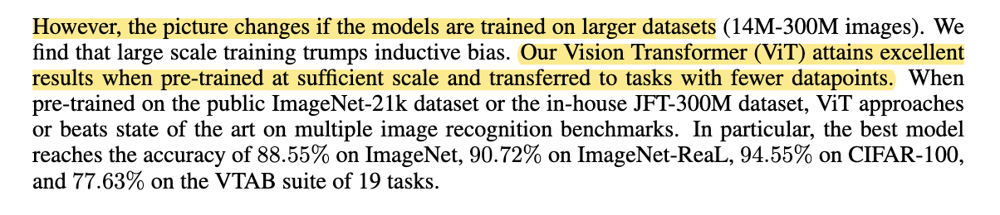
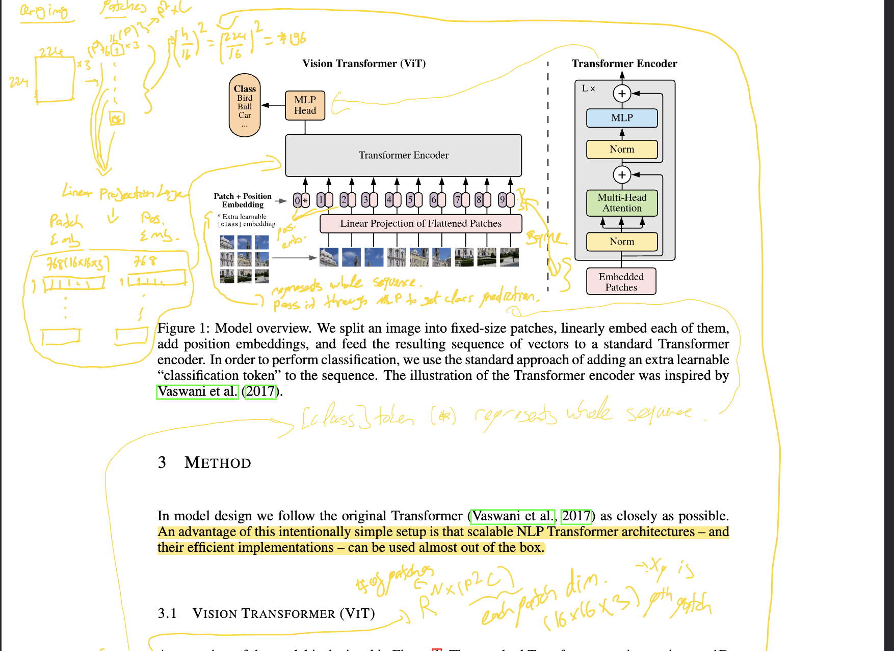

# Vision-Transformers

### Steps:

- Split the image into patches
- Embed each patch into a lower dimensional vector using a linear projection layer.
- Add positional encodings
- Add an additional **learnable classification token** to the sequence that will be used to make predictions.
- Initialize the `classification token` with random values and then train it along with the rest of the model.
- Pass the embeddings (including the classification token) through a series of encoder blocks.
- The output of the final encoder block is called the **`pooled features or global representation of the image`**. The term "contextual embeddings" is not commonly used in the context of vision transformers.
- Pass the *`classification token's embedding`* through a **Multi-Layer Perceptron (MLP)** to make predictions.

---

## ViT Paper: [An Image is Worth 16x16 Words: Transformers for Image Recognition at Scale](https://arxiv.org/abs/2010.11929)

- [ViT](./ViT.pdf) is a simple vision transformer architecture that replaces the convolutions in the backbone of the popular convolutional neural networks with a transformer encoder.

#### Abstract:

#### Proposed Model:

#### Pre-Train then fine-tune ViT:

#### Architecture:

